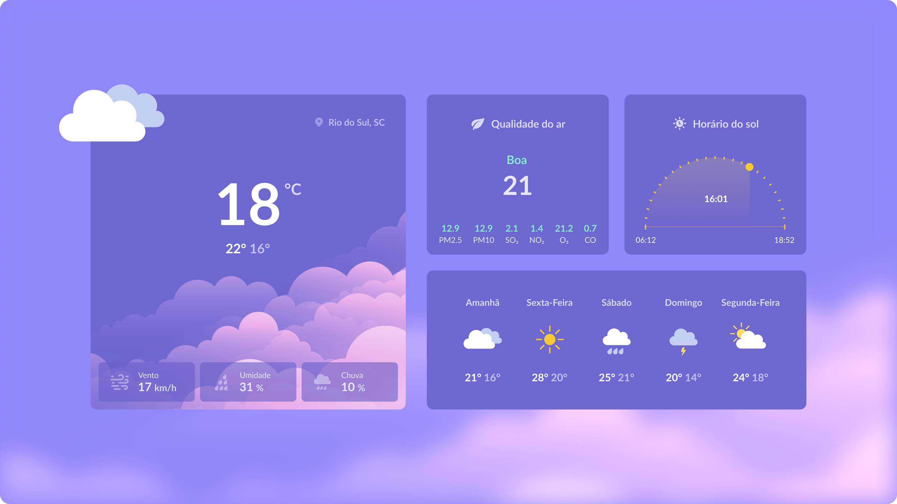

# <h1 align="center"> **#boraCodar uma Página de Clima** ☁ </h1>

#### <h3 align="justify">O objetivo a ser cumprido é programar uma página que apresente informações metereológicas atuais, e também a previsão para os próximos dias. Sendo assim, fiz algumas mudanças pequenas no layout, onde a imagem do layout base está contida neste documento, com isso fiz consumo de três API's, sendo a primeira para pegar a <a href="https://openweathermap.org/current">geolocalização</a> para alimentar as demais Api's que usada também para <a href="https://open-meteo.com/en/docs"> informações climáticas </a>, mas aparentemente tem maior precição e por fim para apresentar a<a href="https://open-meteo.com/en/docs/air-quality-api#"> qualidade do ar </a>utilizando como base as métricas europeias para essa definição. Fiz está primeira parte com HTML, CSS e javaScript puro , mas pretendo fazer algumas melhorias e passar para react-native.

#

  

#### <h3 align="center"> Esse projeto foi desenvolvido com </h3>

### 
 **HTML | CSS | JavaScript** 

 

### <h3 align="center"> [Acesse meu perfil no Linkedin aqui](https://www.linkedin.com/in/rafael-bezerra-088b83a1/) </h3>
